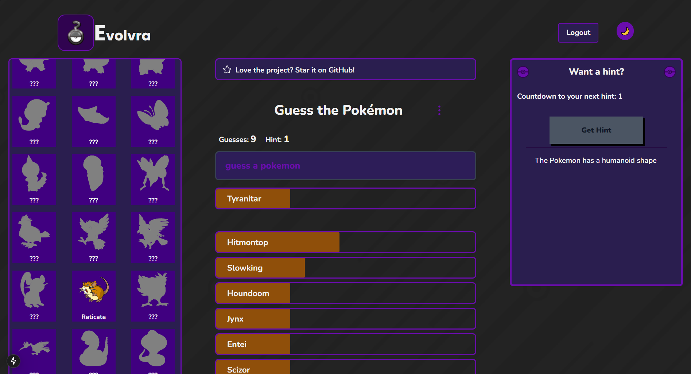

# Evolvra

**Evolvra** is an interactive game where players guess Pokémon based on clues. Successfully identifying Pokémon adds them to a player's inventory, where silhouettes transform into images of the caught Pokémon, enhancing the gameplay experience.

<p align='center'>
  
</p>

<p align='center'>
  <a href="https://evolvra.vercel.app">
    
  </a>
</p>

## Features
- **Engaging Gameplay**: Test your Pokémon knowledge through a fun guessing game.
- **Dynamic Inventory System**: Caught Pokémon are showcased in an evolving inventory.
- **Leaderboard**: Track progress and compete with others in real-time.
- **Hint System**: Get help to identify challenging Pokémon.
- **Responsive Design**: Optimized for both desktop and mobile devices.
- **Firebase Integration**: Utilizes Firebase for user authentication and data management.

## Technologies Used
- **Frontend**: Next.js, Tailwind CSS
- **Backend**: Firebase (Authentication & Database)
- **Deployment**: Vercel

## How to Play
1. Log in to Evolvra.
2. Use the provided clues to guess the Pokémon.
3. Correct guesses add the Pokémon to your inventory.
4. View caught Pokémon in your inventory with their images and names revealed.

## Setup Instructions
1. Clone the repository:
   ```bash
   git clone https://github.com/yourusername/evolvra.git
   ```

2. Navigate to the project directory:
   ```bash
   cd evolvra
   ```

3. Install dependencies:
   ```bash
   npm install
   ```

4. Start the development server:
   ```bash
   npm run dev
   ```

## Future Enhancements
- **Caching**: Implement image caching for performance.

## Contributing
- Contributions are welcome! Fork the repo and submit a pull request.
